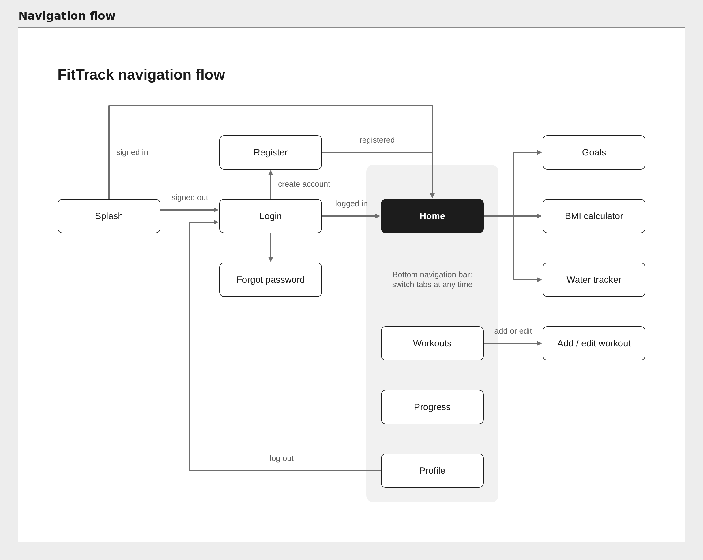
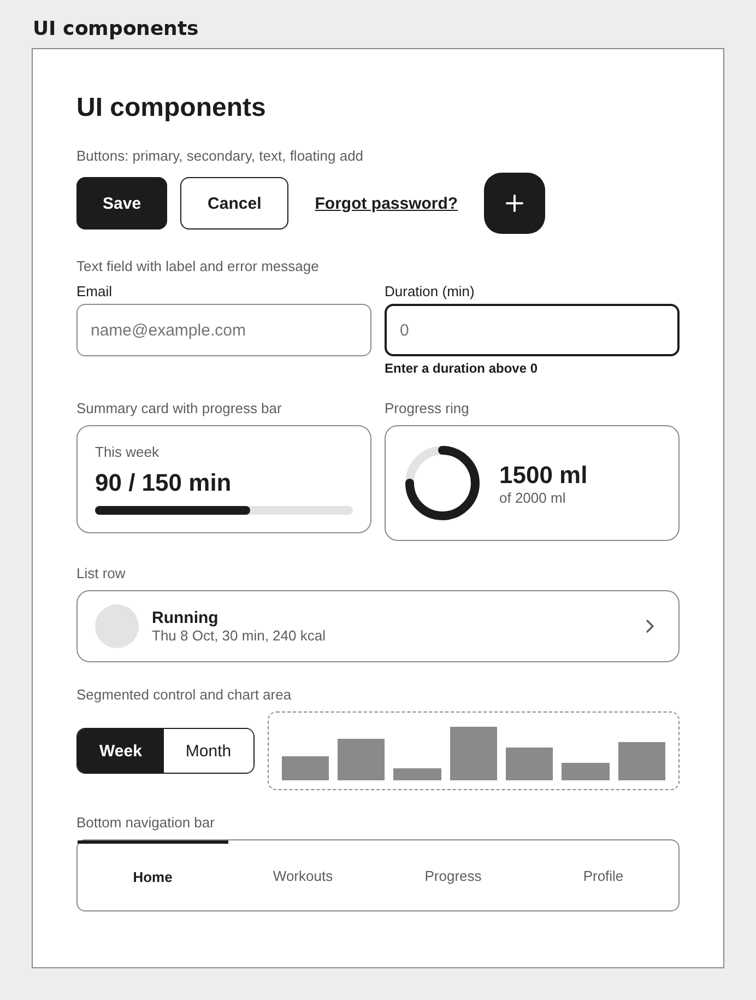
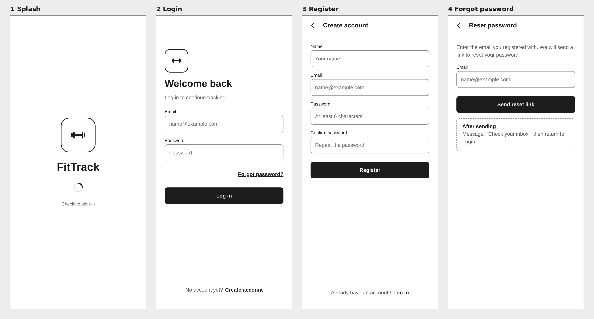
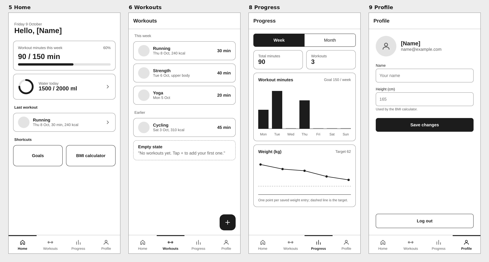
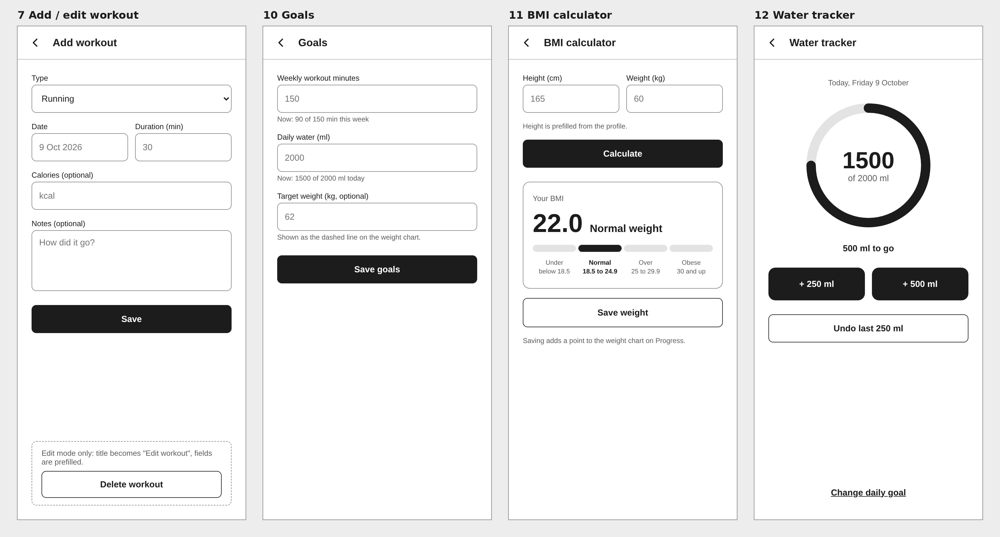

# FitTrack: wireframes

Low-fidelity wireframes for all 12 screens, the navigation flow and the shared UI components.

## Navigation flow

## UI components

## Sign-in screens

## Bottom navigation tabs

## Screens opened from Home and Workouts

